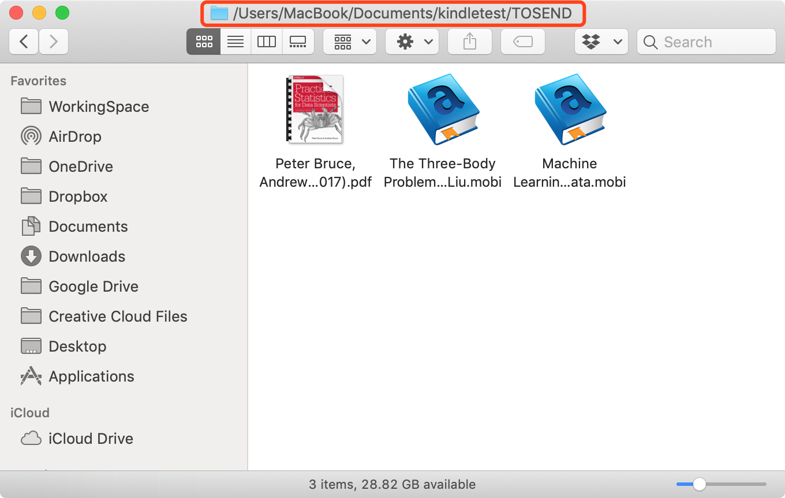

# kindle-pal


支持系统：
* 编译安装：Linux, Mac OS, Windows
* 可执行文件：目前只有 Mac OS

现有功能：

（1）一键式将文件夹中所有Kindle支持的文件进行推送。

（2）根据高可读配置文件自动语言切换。（中文和英文）

-------
### 开启权限（重要）：

请通过浏览器登录您的QQ邮箱，然后进入账户设置。


在最下面找到POP3/IMAP等服务，打开前面3个服务。


**权限设置非常重要。没有设置之前无法推送。**

### 快速启动：

Mac OS (推荐二进制文件)

*环境依赖*

```
#如果你没有安装homebrew，运行以下命令
/usr/bin/ruby -e "$(curl -fsSL https://raw.githubusercontent.com/Homebrew/install/master/install)" # if you have no homebrew installed

#安装wget
brew install wget
```

*安装启动*

```
mkdir KindleUtils

cd KindleUtils

wget https://github.com/songlinhou/kindle-pal/raw/master/dist/kindle_push

chmod +x kindle_push

./kindle_push

```

Mac OS + Linux + Windows


```
cd ~

pip clone https://github.com/songlinhou/kindle-pal.git

cd kindle-pal

python start.py

```
注意：由于Windows并不自带Python环境。因此需要首先按照Python运行环境。

-------
使用说明

（1）首次运行程序时，会自动生成config.txt文件。


利用文本编辑器打开，内容显示如下。


```
下面的内容包含(1)中文和(2)英文配置，请选择其中一项填写即可。

注意：在使用本工具之前，请先确认qq邮箱地址在您的亚马逊账号发件人认可列表中，否则将无法实现推送。
请登录 www.mazon.cn/myk 确认认可列表和您的Kindle邮箱。
Configurations in (1)Chinese and (2)English are available below. You only need to choose one to fill.

Notice: Before using this tool, please confirm your QQ email address is included in the addressor whitelist of your amazon account. Or you cannot receive the pushed content in your device.

Please sign in www.mazon.cn/myk and confirm your addressor whitelist and Kindle email address. 


(1)中文配置
请在下方替换你的推送信息：
可以用于推送的QQ邮件地址=xxxxxx@qq.com
QQ邮件的登录密码=123123
Kindle邮箱=123123@kindle.cn


(2)Configuration in English
Please replace the following information using yours：
Your QQ Email Address for Book Push=xxxxxx@qq.com
Email Password=123123
Kindle Email Address=123123@kindle.cn


配置完成后即可使用。


You can use this program right after configuration.
```
对于中文用户，请在 **（1）中文配置**中输入必要的推送信息。
For English users, please fill the fields in **Section (2)**

（2）再次运行程序

使用二进制文件的用户按照如下命令


```
./kindle_push
```

使用源码方式运行的用户按照如下命令


```
python start.py
```


程序会默认生成两个子目录，分别为 **TOSEND** 和 **SENT**，解释如下

**TOSEND** 路径下存放你希望推送的电子书文件。当你需要推送新的电子书时，将电子书拷贝至该目录。
**SENT** 路径下存放了已经推送完成的电子书文件。当电子书推送后，会自动被移动至该目录。

（3）放入需要推送的电子书



打开 **TOSEND** 路径，放入支持的电子书文件。目前Kindle默认支持的格式包含：

* .azw3
* .azw
* .txt
* .pdf
* .mobi
* .prc

放入其它类型的文件会被程序直接忽略。此外，出于亚马逊的限制，所有的电子书文件大小不能超过50MB，如果 **TOSEND** 目录下有多个电子书文件，那么每次推送最多推送50MB。文件总大小超过50MB时，可能需要多次使用该程序进行分批推送。

（4）进行推送

参照步骤（2）再次运行程序，程序会列出即将推送的文件信息。当推送的文件中包含.pdf文件时，用户可以选择是否需要自动转换为和Kindle更加适配的阅读格式。当推送完成后，程序运行结束。


注意：由于发现中文文件名可能产生的乱码问题。该工具会将中文文件名翻译为英文进行推送。此修改只会影响到Kindle接收时的文件名显示，而不会修改本地文件。


